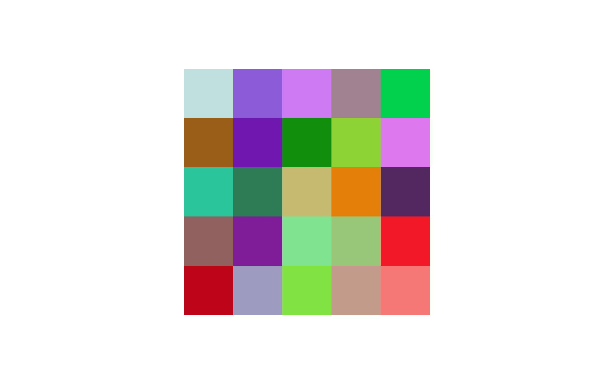
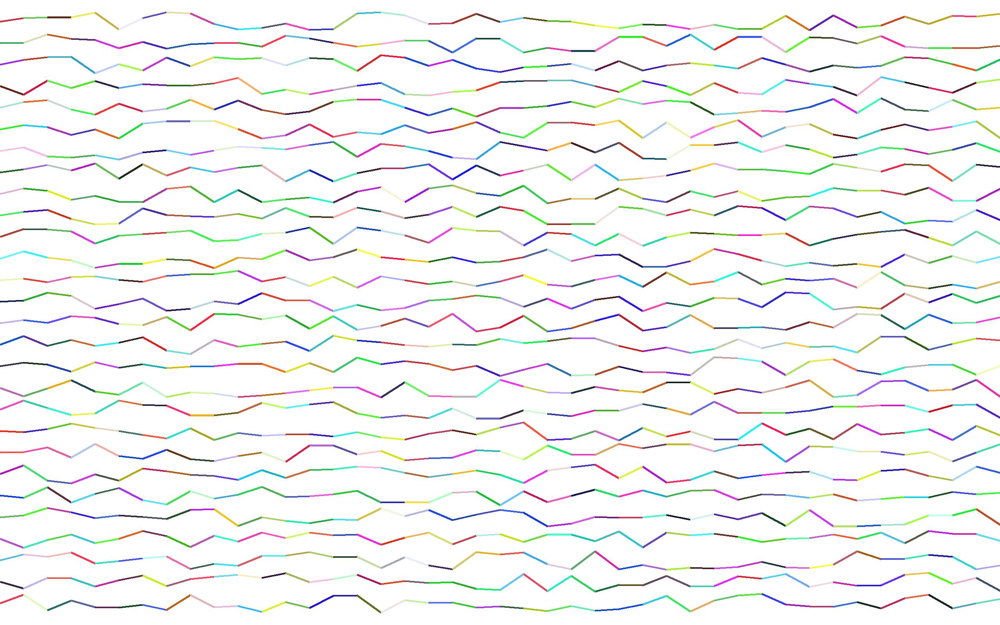

# wallgen
Tools to generate wallpapers.

## requirements
First, install requirements with `pip install -r requirements.txt`

`fortune` should also be installed to work with `inspiropaper.py`.

## inspiropaper
Create inspiring wallpapers with `fortune`.

### Usage
`python inspiropaper.py <width> <height>`

Add new images in the `images` folder, and fonts in the `fonts` folder.

The resulting wallpapers go in the `wallpapers` folder.

## wallpaper
Create wallpapers with patterns.

### Usage
`python wallpaper.py [-h] [-q [SEQUENCE]] [-s [SQUARE]] [-g [GRADIENT]] width height`

The resulting wallpaper is saved at `wallpapers/pattern.jpg`.

## joydivision
Create wallpapers with lines, somewhat inspired by Joy Division's "Unknown Pleasures"

### Usage
`python joydivision.py <width> <height>`

Additional settings can be tweaked inside the script.

The resulting wallpaper is saved at `wallpapers/unknownpleasures.jpg`.
